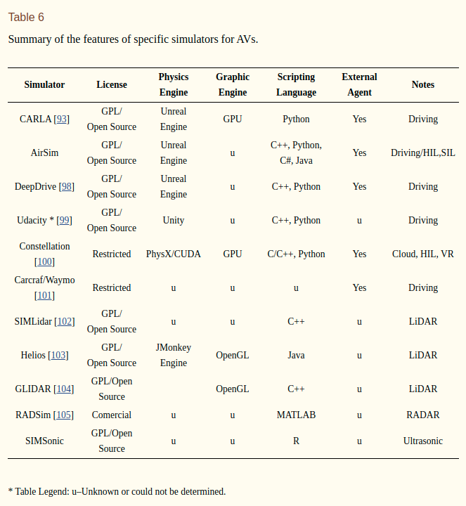
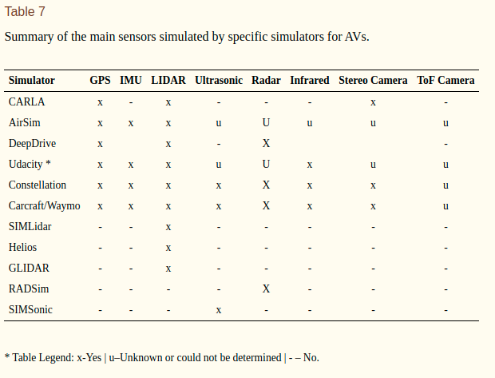

Comparison of Simulators
============================

.. csv-table:: Table 1: Comparison of Autonomous Simulators
   :file: ../../_tables/simulators.csv
   :header-rows: 1

Notes:
  - All simulators require dedicated GPU
  - SITL: Software in the Loop

Comparison from the `paper <https://www.ncbi.nlm.nih.gov/pmc/articles/PMC6387009/>`_:

